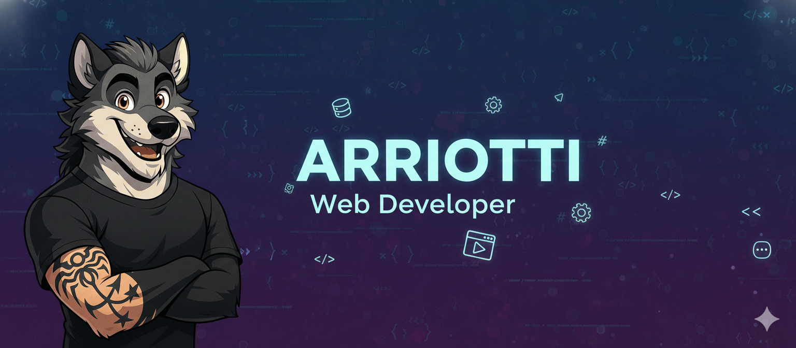
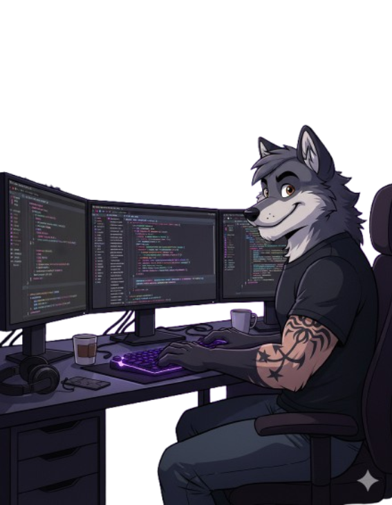
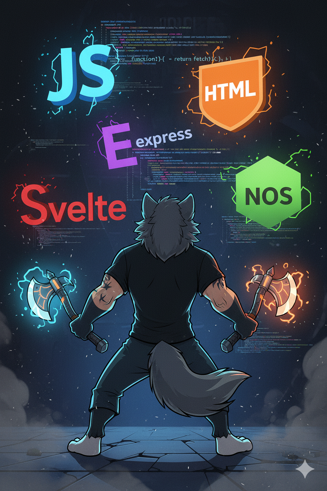

<!-- Banniere -->

  
  <!-- Alt text amélioré pour le SEO et l'accessibilité -->

<!-- Premiere colonne -->

#
[anglais](README.md) | [francais](READMEFR.md)

## Hi! 

<table width="100%">
  <tr>
    <!-- COLONNE GAUCHE : Contenu principal -->
    <td width="60%" valign="top">
      <!-- En-tête avec animation GIF pour attirer l'attention -->
      <h1>
        <!--  -->
        My name is <strong>ARRIOTTI Julien</strong> 
      </h1>
       
    <h2>🚀FullStack Web & Mobile Developer Junior
    </h2>
      

      💡 Trained at O'clock with a professional qualification in Web & Mobile Web Development. Curious, thorough and focused on finding solutions, I enjoy learning and progressing every day.
      

      <h2>
         About me 
      </h2>
      

        🛠️I tried my hand at several different jobs before finding what really motivates me. Thanks to my friends and family, I discovered web development, a field that fascinates me and encourages me to always push myself further. So I decided to change careers and enrol in a training programme at O'clock. Curious, rigorous and solution-oriented, I enjoy learning and progressing every day.
      

        <td width="40%" valign="top" align="right" style="padding: 20px;">
      
    </td>
  </tr>
</table>
 

---

<table width="100%" align="center">
  <tr>
    <td valign="top" width="35%">
      
       

  <h2>⚡What I do</h2>
      <!-- Service principal -->
      
<strong>🯠FullStack Development </strong>        
      I design high-performance web and mobile applications, from front to back, using modern technologies and rigorous development practices.

     
 <!-- Liste des services spécifiques -->
  
   
  <h2> 💻 My goals :</h2>

<li>✨  Develop innovative Full Stack projects</li>
<li>🧩  Deepen my knowledge of TypeScript and modern architectures</li>
<li>🤝  Contribute to open source projects</li>
<li>📚  Share my knowledge and learn from the community
illustration of me fighting software 
html5 logo html5 logo pocketbase logo</li> 
</td>
  <td valign="top" width="30%" align="center">
      

    
    
    

  
  
    
  

  
  
  
  
  

 
   
   
   

    </td>
    <!-- COLONNE DROITE : Stack technique complète -->
    <td valign="top" width="35%">
         <h2>🛠️ Technical Stack</h2>
      <!-- Frontend technologies -->
      
<strong>🨠Frontend</strong>

      <ul>
        <li>HTML5 | CSS3 </li>
        <li>JavaScript | Svelte</li>
        <li>Modern and responsive interfaces</li>
      </ul>
       <!-- Backend -->
      
<strong>⚙️ Backend</strong>

      <ul>
        <li>Node.js, Express</li>
        <li>PostgreSQL, Sequelize</li>
        <li>High-performance & secure APIs</li>
      </ul>
       <!-- Mobile & Desktop -->
      
<strong>📱 Mobile & Desktop </strong>

      <ul>
        <li> Hybrid applications and custom tools</li>
      </ul>
       <!-- Design -->
       
<strong>🨠Design</strong>

      <ul>
        <li> Figma | responsive and accessible interfaces</li>
      </ul>
      <!-- DevOps et outils -->
      
<strong>🧰 Tools & DevOps</strong>

      <ul>
        <li>Git | NPM | PocketBase | VSCode | Postman | Docker</li>
      </ul>
    </td>
  </tr>
</table>

 

---

  <!-- Badge Followers GitHub -->
  
  <!-- Badge Stars totales -->
  
  <!-- Compteur de vues du profil -->
  

<table width="100%" align="center">
  <tr>    
    <td valign="top" width="40%" align="center" style="padding: 10px;">
      <h2 align="center">🎯Currently</h2>
      <!-- Image mascotte thématique -->
      
    
  

      
🚀 Evolving as a FullStack Developer.
       
      I use my skills to build high-performance applications and explore modern technologies.
    

      

   
   <ul align="left">
        <li>✨ <strong>Full Stack JavaScript</strong> projects (Svelte / Node / PostgreSQL)</li>
        <li>🧩 Exploration of <strong>TypeScript avancé</strong> & <strong>microservices architectures</strong></li>
        <li>🤝 <strong>open source</strong> collaborations and knowledge sharing</li>
        <li>💬 Consulting & mentoring on<strong>Svelte, Node.js, PostgreSQL</strong></li>
      </ul>
       
   </td>

   <td valign="top" width="60%">
      <h2 align="center">📈 GitHub statistics</h2>
      <!-- 
        STATS PRINCIPALES
        Via github-readme-stats par anuraghazra
        Options personnalisées : thème tokyo-night, sans bordures
      -->
      

        
      

      <!-- 
        STREAK STATS
        Suivi de la régularité des contributions
      -->
       

        
      

      <!-- 
        LANGAGES LES PLUS UTILISÉS
        Analyse automatique des repos publics
      -->
      

        
      

  </td>
  </tr>
</table>

---

<h2>💡My philosophy</h2>
      <pre><code class="language-javascript">const developer = {
    name: ‘Julien Arriotti’,
  mindset: ‘Learn by doing 🛠️’,
  approach: ‘Readable & maintainable code > Clever code’,
  passion: ‘Creating useful and effective solutions’,
  values: [‘Curiosity’, ‘Rigour’, ‘Collaboration’],
  goal: ‘Progress every day and create value 🚀’
};

console.log(${developer.name} is ready to code! 🐺);</code></pre>
    
  <table width="100%">
  <tr>
    <td valign="middle" width="20%">
      <h2>best projects</h2>
      

        <a href="https://github.com/JulienARRIOTTI/O-Coffee.git" target="_blank">
          O'Coffee
           
          
        </a>
      

      

        <a href="https://github.com/JulienARRIOTTI/O-chat.git" target="_blank">
          O'Chat IA
           
          
        </a>
      

    </td>
    <td valign="middle" width="40%" align="center">
      
    </td>
  </tr>
  
  <tr>
    <td valign="middle" width="40%" align="center">
      
    </td>
    <td valign="middle" width="50%">
      <h2>Activité récente</h2>
      

        <a href="https://github.com/JulienARRIOTTI/JdrRandom.git" target="_blank">
          JDR Random
           
          
        </a>
      

      

        <a href="https://github.com/JulienARRIOTTI/Page-Cosplay.git" target="_blank">
          Page Cosplay
           
          
        </a>
      

    </td>
  </tr>
</table>

---  

---
## Social Networks

  

---
## Contact
📧 **Email** :
<a href="arriotti-julien67@hotmail.fr" target="blank">arriotti-julien67@hotmail.fr</a>

