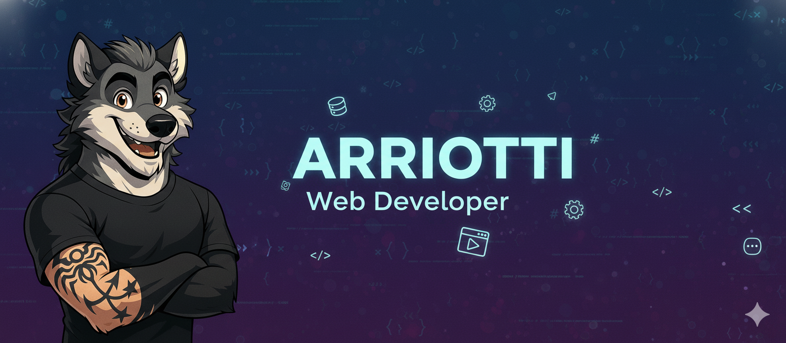
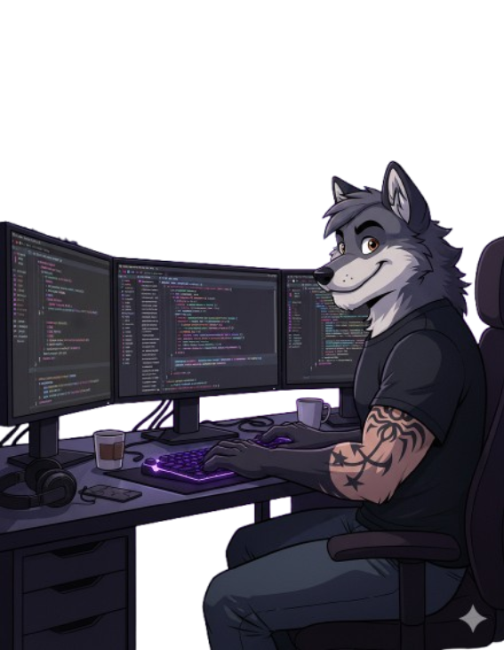
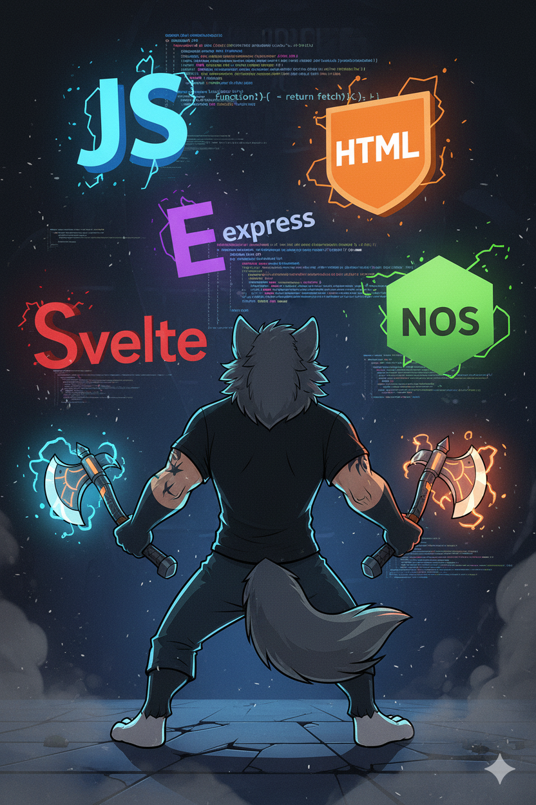
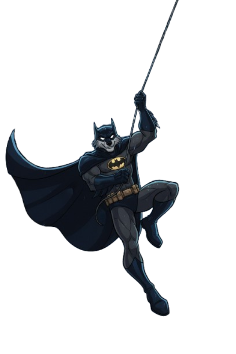
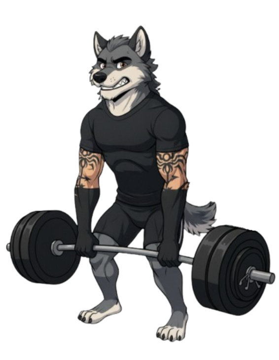
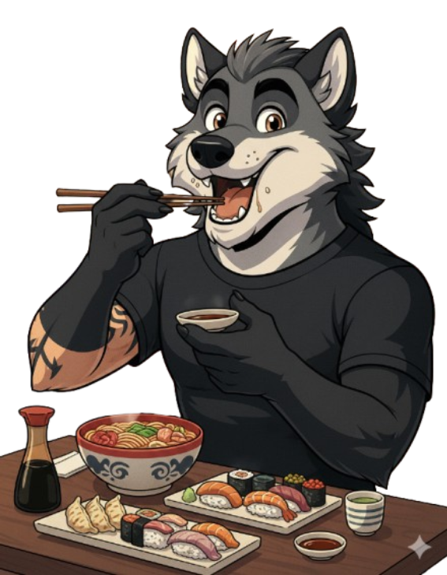
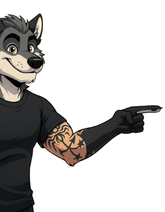

<!-- Banniere -->

  
  <!-- Alt text amélioré pour le SEO et l'accessibilité -->

<!-- Premiere colonne -->

#
[anglais](README.md) | [francais](READMEFR.md)

## Salut! 

<table width="100%">
  <tr>
    <!-- COLONNE GAUCHE : Contenu principal -->
    <td width="60%" valign="top">
      <!-- En-tête avec animation GIF pour attirer l'attention -->
      <h1>
        <!--  -->
        Moi, c’est <strong>ARRIOTTI Julien</strong> 
      </h1>
       
    <h2>🚀Développeur Junior Web & Mobile FullStack 
    </h2>
      

      💡 Formé chez O'clock au titre professionnel de Développeur Web & Web Mobile.
      Curieux, rigoureux et tourné vers la recherche de solutions, je prends plaisir à apprendre et à progresser chaque jour.
      

      <h2>
         A propos de moi 
      </h2>
      

        🛠️J’ai exercé plusieurs métiers avant de trouver ce qui me motive vraiment. Grâce à mon entourage, j’ai découvert le développement web, un domaine qui me passionne et m’encourage à aller toujours plus loin.
        J’ai donc décidé de me reconvertir et de suivre une formation chez O’clock. Curieux, rigoureux et tourné vers la recherche de solutions, je prends plaisir à apprendre et à progresser chaque jour.
      

        <td width="40%" valign="top" align="right" style="padding: 20px;">
      
    </td>
  </tr>
</table>
 

---

<table width="100%" align="center">
  <tr>
    <td valign="top" width="35%">
      
       

  <h2>⚡ Ce que je fais</h2>
      <!-- Service principal -->
      
<strong>🎯 Développement FullStack</strong>        
      Je conçois des applications web et mobiles performantes, du front au back, en m'appuyant sur des technologies modernes et des pratiques de développement rigoureuses.

     
 <!-- Liste des services spécifiques -->
  
   
  <h2> 💻 Mes objectifs :</h2>

<li>✨ Développer des projets Full Stack innovants</li>
<li>🧩 Approfondir TypeScript et les architectures modernes</li>
<li>🤝 Contribuer à des projets open source</li>
<li>📚 Partager mes connaissances et apprendre de la communauté</li> 
</td>
  <td valign="top" width="30%" align="center">
      

    
    
    

  
  
    
  

  
  
  
  
  

 
   
   
   

    </td>
    <!-- COLONNE DROITE : Stack technique complète -->
    <td valign="top" width="35%">
         <h2>🛠️ Stack Technique</h2>
      <!-- Frontend technologies -->
      
<strong>🎨 Frontend</strong>

      <ul>
        <li>HTML5 | CSS3 </li>
        <li>JavaScript | Svelte</li>
        <li>Interfaces modernes et responsives</li>
      </ul>
       <!-- Backend -->
      
<strong>⚙️ Backend</strong>

      <ul>
        <li>Node.js, Express</li>
        <li>PostgreSQL, Sequelize</li>
        <li>API performantes & sécurisées</li>
      </ul>
       <!-- Mobile & Desktop -->
      
<strong>📱 Mobile & Desktop </strong>

      <ul>
        <li> Applications hybrides et outils sur mesure</li>
      </ul>
       <!-- Design -->
       
<strong>🎨 Design</strong>

      <ul>
        <li> Figma | interfaces responsives et accessibles</li>
      </ul>
      <!-- DevOps et outils -->
      
<strong>🧰 Outils & DevOps</strong>

      <ul>
        <li>Git | NPM | PocketBase | VSCode | Postman | Docker</li>
      </ul>
    </td>
  </tr>
</table>

 

---

  <!-- Badge Followers GitHub -->
  
  <!-- Badge Stars totales -->
  
  <!-- Compteur de vues du profil -->
  

<table width="100%" align="center">
  <tr>    
    <td valign="top" width="40%" align="center" style="padding: 10px;">
      <h2 align="center">🎯 Actuellement</h2>
      <!-- Image mascotte thématique -->
      
    
  

      
🚀 En pleine évolution en tant que Développeur FullStack.
       
      Je mets à profit mes compétences pour construire des applications performantes et explorer les technologies modernes.
    

      

   
   <ul align="left">
        <li>✨ Projets <strong>Full Stack JavaScript</strong> (Svelte / Node / PostgreSQL)</li>
        <li>🧩 Exploration de <strong>TypeScript avancé</strong> & des <strong>architectures microservices</strong></li>
        <li>🤝 Collaborations <strong>open source</strong> et partage de savoir</li>
        <li>💬 Conseil & mentorat sur <strong>Svelte, Node.js, PostgreSQL</strong></li>
      </ul>
       
   </td>

   <td valign="top" width="60%">
      <h2 align="center">📈 Statistiques GitHub</h2>
      <!-- 
        STATS PRINCIPALES
        Via github-readme-stats par anuraghazra
        Options personnalisées : thème tokyo-night, sans bordures
      -->
      

        
      

      <!-- 
        STREAK STATS
        Suivi de la régularité des contributions
      -->
       

        
      

      <!-- 
        LANGAGES LES PLUS UTILISÉS
        Analyse automatique des repos publics
      -->
      

        
      

  </td>
  </tr>
</table>

---

<h2>💡Ma philosophie</h2>
      <pre><code class="language-javascript">const developer = {
  name: "Julien Arriotti",
  mindset: "Apprendre en faisant 🛠️",
  approach: "Code lisible & maintenable > Code clever",
  passion: "Créer des solutions utiles et efficaces",
  values: ["Curiosité", "Rigueur", "Collaboration"],
  goal: "Progresser chaque jour et créer de la valeur 🚀"
};

console.log(`${developer.name} is ready to code! 🐺`);</code></pre>
    
 <table width="100%">
  <tr>
    <td valign="middle" width="20%">
      <h2>Meilleurs Projets:</h2>
      

        <a href="https://github.com/JulienARRIOTTI/O-Coffee.git" target="_blank">
          O'Café
           
          
        </a>
      

      

        <a href="https://github.com/JulienARRIOTTI/O-chat.git" target="_blank">
          O'Chat IA
           
          
        </a>
      

    </td>
    <td valign="middle" width="40%" align="center">
      
    </td>
  </tr>
  
  <tr>
    <td valign="middle" width="40%" align="center">
      
    </td>
    <td valign="middle" width="50%">
      <h2>Activité récente</h2>
      

        <a href="https://github.com/JulienARRIOTTI/JdrRandom.git" target="_blank">
          JDR Random
           
          
        </a>
      

      

        <a href="https://github.com/JulienARRIOTTI/Page-Cosplay.git" target="_blank">
          Page Cosplay
           
          
        </a>
      

    </td>
  </tr>
</table>

---  

---
## Réseaux Sociaux

  

---
## Contact
📧 **Email** :
<a href="arriotti-julien67@hotmail.fr" target="blank">arriotti-julien67@hotmail.fr</a>

